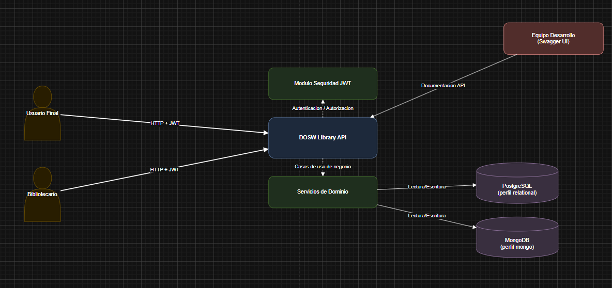
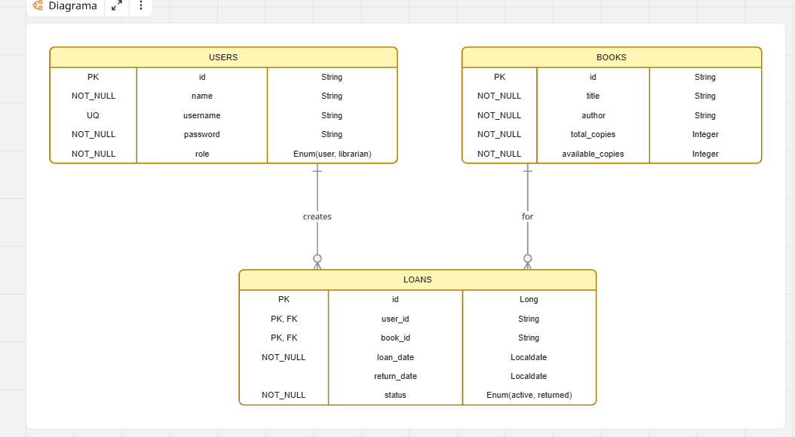
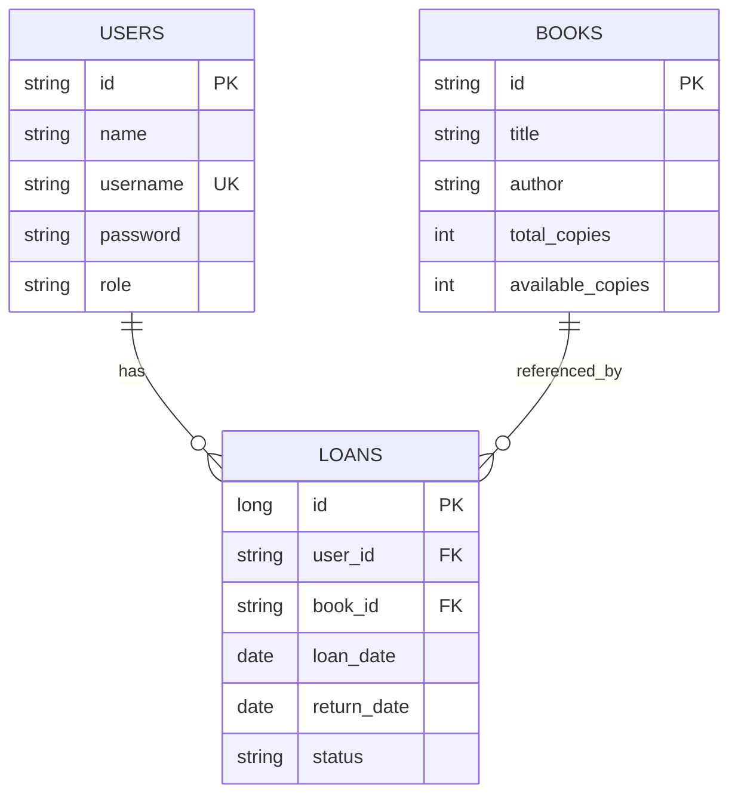
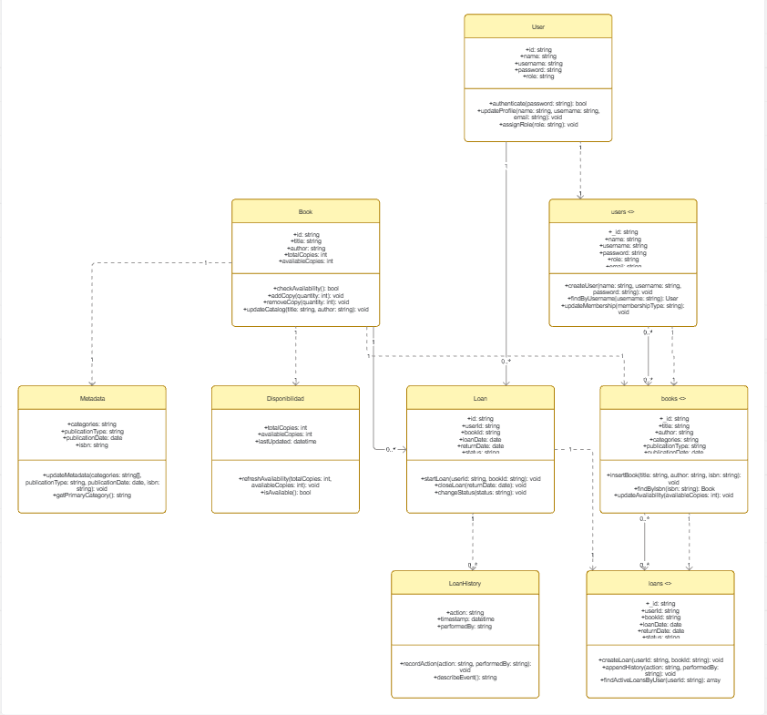
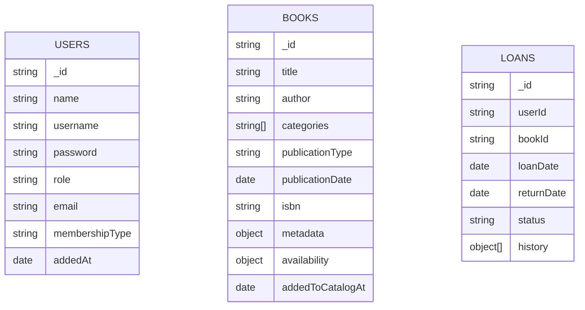
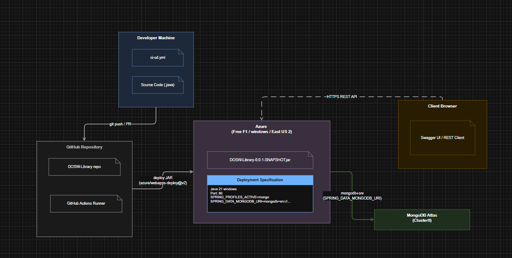
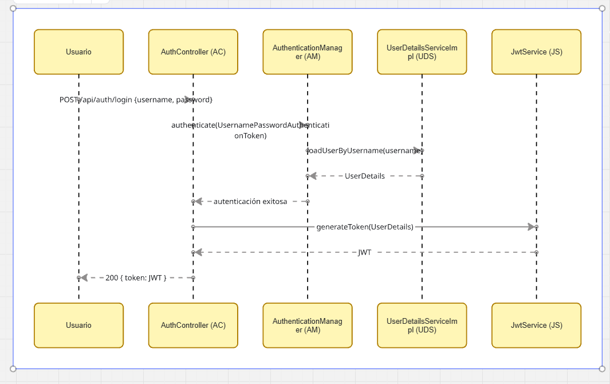
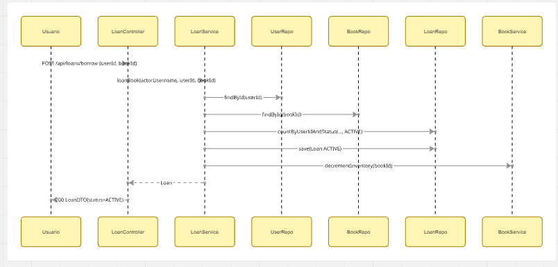
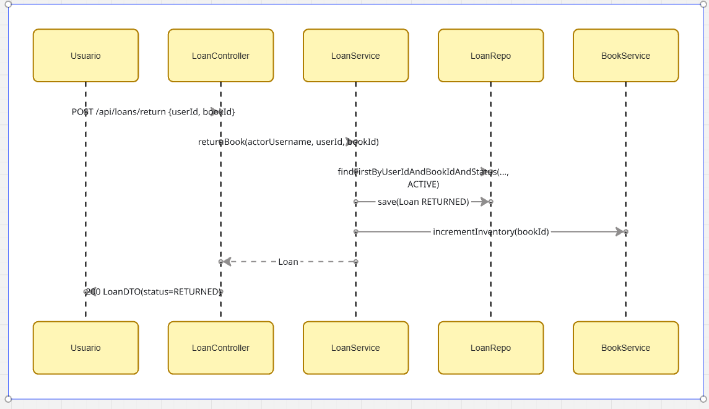

# High Level Design - DOSW Library

## Tabla de contenido

- [1. Descripcion del Servicio](#1-descripcion-del-servicio)
  - [1.1 Objetivos del servicio](#11-objetivos-del-servicio)
  - [1.2 Diagrama de contexto](#12-diagrama-de-contexto)
- [2. Tecnologias a usar](#2-tecnologias-a-usar)
  - [2.1 Lenguaje y framework](#21-lenguaje-y-framework)
  - [2.2 Persistencia](#22-persistencia)
  - [2.3 Calidad, documentacion y build](#23-calidad-documentacion-y-build)
- [3. Funcionalidades identificadas y Casos de Uso](#3-funcionalidades-identificadas-y-casos-de-uso)
- [4. Arquitectura y Diagramas](#4-arquitectura-y-diagramas)
- [5. Diagrama de Base de Datos y explicacion](#5-diagrama-de-base-de-datos-y-explicacion)
- [6. Funcionalidades Expuestas (API)](#6-funcionalidades-expuestas-api)
- [7. Manejo de Errores](#7-manejo-de-errores)
- [8. Diagramas de Secuencia y explicacion](#8-diagramas-de-secuencia-y-explicacion)
- [9. Consideraciones de diseño](#9-consideraciones-de-diseño)
- [10. Bibliografia](#10-bibliografia)

## 1. Descripcion del Servicio

DOSW Library es un servicio backend REST para la gestion de una biblioteca. Permite administrar usuarios, catalogo de libros y prestamos/devoluciones con reglas de negocio y control de acceso por roles.

El servicio esta pensado para dos tipos de actor:

- `USER`: consulta su perfil, consulta inventario y gestiona sus propios prestamos.
- `LIBRARIAN`: administra usuarios y libros, y puede consultar/gestionar prestamos de cualquier usuario.

### 1.1 Objetivos del servicio

- Gestionar el ciclo de vida de libros en inventario.
- Gestionar usuarios con autenticacion JWT.
- Controlar prestamos con reglas de disponibilidad y limite de prestamos activos.
- Exponer API documentada via OpenAPI/Swagger.
- Soportar persistencia por perfil: relacional (`PostgreSQL`) o no relacional (`MongoDB`).

### 1.2 Diagrama de contexto



El diagrama de contexto muestra la relacion entre los actores externos y la API principal de DOSW Library. Los usuarios finales y el bibliotecario acceden al sistema mediante solicitudes HTTP protegidas con JWT, mientras que la API central coordina la autenticacion, la logica de negocio y el acceso a los datos.

Ademas, el diagrama evidencia que la aplicacion separa sus responsabilidades internas en una capa de seguridad, una capa de servicios de dominio y una capa de persistencia, la cual puede operar con PostgreSQL en el perfil relacional o con MongoDB en el perfil no relacional.

## 2. Tecnologias a usar

### 2.1 Lenguaje y framework

- Java 21
- Spring Boot 3.2.5
- Spring Web
- Spring Security (JWT)
- Spring Data JPA
- Spring Data MongoDB

### 2.2 Persistencia

- PostgreSQL (perfil `relational`, por defecto)
- MongoDB (perfil `mongo`)
- H2 en pruebas (`application-test.yaml`)

### 2.3 Calidad, documentacion y build

- Maven
- JUnit 5 + Spring Boot Test + Spring Security Test
- JaCoCo
- OpenAPI/Swagger (`springdoc-openapi-starter-webmvc-ui`)
- Sonar Maven Plugin

## 3. Funcionalidades identificadas y Casos de Uso

| Modulo | Funcionalidad | Actor principal | Caso de uso | Reglas y restricciones |
|---|---|---|---|---|
| Autenticacion y autorizacion | Login y emision de JWT | Usuario/Bibliotecario | El actor envia `username/password` y obtiene token para consumir endpoints protegidos | Token JWT requerido en rutas protegidas; autorizacion por rol con `@PreAuthorize` |
| Autenticacion y autorizacion | Validacion de token en requests | Sistema | En cada request con `Authorization: Bearer <token>`, se valida firma y expiracion | Si el token es invalido/expirado responde `401` |
| Gestion de usuarios | Registro publico | Usuario | Crear cuenta con rol por defecto | `POST /api/users/register`; rol asignado `USER`; username unico |
| Gestion de usuarios | Creacion de usuario por bibliotecario | Bibliotecario | Crear usuario indicando rol | Solo `LIBRARIAN`; rol valido `USER|LIBRARIAN` |
| Gestion de usuarios | Consulta de perfil | Usuario/Bibliotecario | Ver datos de usuario por `userId` | `USER` solo su propio perfil; `LIBRARIAN` cualquier perfil |
| Gestion de usuarios | Listado de usuarios | Bibliotecario | Consultar listado completo de usuarios | Solo `LIBRARIAN` |
| Gestion de libros | Consulta de inventario | Usuario/Bibliotecario | Listar libros disponibles y stock | Acceso `USER|LIBRARIAN` |
| Gestion de libros | Creacion de libro | Bibliotecario | Registrar un nuevo libro en catalogo | Solo `LIBRARIAN`; `totalCopies > 0`; `0 <= availableCopies <= totalCopies` |
| Gestion de libros | Actualizacion de stock | Bibliotecario | Ajustar stock total y disponible | Solo `LIBRARIAN`; `totalCopies > 0`; `0 <= availableCopies <= totalCopies` |
| Gestion de prestamos | Registrar prestamo | Usuario/Bibliotecario | Crear prestamo de libro para usuario | Maximo 3 prestamos `ACTIVE` por usuario; libro debe tener disponibilidad |
| Gestion de prestamos | Registrar devolucion | Usuario/Bibliotecario | Marcar prestamo como `RETURNED` y fecha de devolucion | Debe existir prestamo `ACTIVE` previo para `userId` y `bookId` |
| Gestion de prestamos | Consultar prestamos por usuario | Usuario/Bibliotecario | Ver historial/lista de prestamos de un usuario | `USER` solo sus prestamos; `LIBRARIAN` puede consultar cualquiera |
| Gestion de prestamos | Consultar todos los prestamos | Bibliotecario | Listar prestamos globales del sistema | Solo `LIBRARIAN` |

## 4. Arquitectura y Diagramas

### 4.1 Vista de componentes 

#### Diagrama general


Este diagrama presenta la vista macro del servicio y la separacion por capas. Se observa el flujo principal desde los controladores hacia los servicios de dominio, luego hacia los puertos de repositorio y finalmente hacia los adaptadores de persistencia, manteniendo desacoplada la logica de negocio de la tecnologia de almacenamiento.

#### Diagrama especifico


Este diagrama detalla los componentes concretos implementados en el proyecto, incluyendo `AuthController`, `UserController`, `BookController`, `LoanController`, los servicios `UserService`, `BookService`, `LoanService`, y los adaptadores por perfil (`JpaImpl` y `MongoImpl`). Tambien muestra el rol transversal de seguridad JWT para autenticacion y autorizacion en los endpoints protegidos.

#### Diagrama de clases (vista existente)


Este diagrama modela las entidades centrales del dominio (`User`, `Book`, `Loan`) y sus relaciones funcionales. La clase `Loan` conecta usuarios y libros, permitiendo representar el estado del prestamo (`ACTIVE` o `RETURNED`) y soportando las reglas de negocio de disponibilidad, limite de prestamos y devolucion definidas en la capa de servicios.


## 5. Diagrama de Base de Datos y explicacion

La aplicacion soporta dos modelos de persistencia por perfil.

### 5.1 Modelo relacional (PostgreSQL)



Tablas principales:

- `users`
- `books`
- `loans`

Relaciones:

- `loans.user_id` -> `users.id`
- `loans.book_id` -> `books.id`



### 5.2 Modelo no relacional 



Colecciones principales:

- `users`
- `books`
- `loans`

El modelo documenta datos enriquecidos (ejemplo: metadata de libros, historial de prestamo), manteniendo compatibilidad con el dominio comun (`User`, `Book`, `Loan`).


### 5.3 Diagrama de despliegue



El diagrama de despliegue muestra la infraestructura donde se ejecuta DOSW-Library, incluyendo el servidor de aplicacion Spring Boot, las bases de datos por perfil (PostgreSQL para relacional, MongoDB para mongo), y las conexiones de red entre componentes.

**Nodos de infraestructura:**
- Servidor Spring Boot (Java 21 Runtime): ejecuta la aplicacion en puerto 80 por defecto, expone los controladores REST y la documentacion Swagger UI.
- PostgreSQL (perfil relacional): base de datos por defecto en puerto 5432 con la base de datos `dosw_library`.
- MongoDB (perfil mongo): alternativa NoSQL con URI configurable, se activa mediante el perfil `spring.profiles.active=mongo`.

**Artefacto principal:** `DOSW-Library-0.0.1-SNAPSHOT.jar` contiene todos los componentes compilados (controladores, servicios, configuraciones, dependencias).

**Variables de entorno críticas:**
- `SERVER_PORT`: puerto del servidor (defecto 80).
- `SPRING_DATASOURCE_URL`: URL de conexion a PostgreSQL.
- `SPRING_DATA_MONGODB_URI`: URI de MongoDB (si se usa perfil mongo).
- `spring.profiles.active`: selecciona entre `relational` o `mongo`.


## 6. Funcionalidades Expuestas (API)

Base path principal: `/api`

### 6.1 Endpoints funcionales

| Modulo | Endpoint | Metodo | Auth | Request | Response | Restricciones |
|---|---|---|---|---|---|---|
| Auth | `/api/auth/login` | `POST` | Publico | JSON `{ username, password }` | `200` JSON `{ token }` | Credenciales validas |
| Usuarios | `/api/users` | `GET` | `LIBRARIAN` | N/A | `200` `UserDTO[]` | Solo bibliotecario |
| Usuarios | `/api/users/{userId}` | `GET` | `USER|LIBRARIAN` | `userId` en path | `200` `UserDTO` | `USER` solo su perfil |
| Usuarios | `/api/users/register` | `POST` | Publico | `UserCreateDTO` | `200` `UserDTO` | Rol por defecto `USER` |
| Usuarios | `/api/users` | `POST` | `LIBRARIAN` | `UserCreateDTO` | `200` `UserDTO` | Rol valido y username unico |
| Libros | `/api/books/inventory` | `GET` | `USER|LIBRARIAN` | N/A | `200` `BookDTO[]` | Acceso autenticado |
| Libros | `/api/books` | `POST` | `LIBRARIAN` | `BookCreateDTO` | `200` `BookDTO` | `totalCopies > 0` y `availableCopies` valido |
| Libros | `/api/books/{bookId}/stock` | `PUT` | `LIBRARIAN` | `bookId` + `BookStockUpdateDTO` | `200` `BookDTO` | Reglas de stock |
| Prestamos | `/api/loans` | `GET` | `LIBRARIAN` | N/A | `200` `LoanDTO[]` | Solo bibliotecario |
| Prestamos | `/api/loans/user/{userId}` | `GET` | `USER|LIBRARIAN` | `userId` en path | `200` `LoanDTO[]` | `USER` solo propios prestamos |
| Prestamos | `/api/loans/borrow` | `POST` | `USER|LIBRARIAN` | `LoanDTO` (`userId`, `bookId`) | `200` `LoanDTO` | Max 3 activos y disponibilidad de libro |
| Prestamos | `/api/loans/return` | `POST` | `USER|LIBRARIAN` | `LoanDTO` (`userId`, `bookId`) | `200` `LoanDTO` | Debe existir prestamo `ACTIVE` |

### 6.2 Estructuras de request/response

| DTO | Campo | Tipo | Requerido | Restricciones |
|---|---|---|---|---|
| `UserCreateDTO` | `id` | `String` | Si | No vacio |
| `UserCreateDTO` | `name` | `String` | Si | No vacio |
| `UserCreateDTO` | `username` | `String` | Si | Unico, no vacio |
| `UserCreateDTO` | `password` | `String` | Si | No vacio |
| `UserCreateDTO` | `role` | `String` | No | `USER|LIBRARIAN` |
| `UserDTO` | `id` | `String` | Si | Identificador de usuario |
| `UserDTO` | `name` | `String` | Si | Nombre visible |
| `UserDTO` | `username` | `String` | Si | Username del sistema |
| `UserDTO` | `role` | `String` | Si | `USER|LIBRARIAN` |
| `BookCreateDTO` | `id` | `String` | Si | No vacio |
| `BookCreateDTO` | `title` | `String` | Si | No vacio |
| `BookCreateDTO` | `author` | `String` | Si | No vacio |
| `BookCreateDTO` | `totalCopies` | `Integer` | Si | `> 0` |
| `BookCreateDTO` | `availableCopies` | `Integer` | Si | `0..totalCopies` |
| `BookStockUpdateDTO` | `totalCopies` | `Integer` | Si | `> 0` |
| `BookStockUpdateDTO` | `availableCopies` | `Integer` | Si | `0..totalCopies` |
| `BookDTO` | `id` | `String` | Si | Identificador de libro |
| `BookDTO` | `title` | `String` | Si | Titulo |
| `BookDTO` | `author` | `String` | Si | Autor |
| `BookDTO` | `totalCopies` | `Integer` | Si | Cantidad total |
| `BookDTO` | `availableCopies` | `Integer` | Si | Cantidad disponible |
| `LoanDTO` | `userId` | `String` | Si | Usuario asociado |
| `LoanDTO` | `bookId` | `String` | Si | Libro asociado |
| `LoanDTO` | `loanDate` | `LocalDate` | No | Fecha de prestamo |
| `LoanDTO` | `returnDate` | `LocalDate` | No | Fecha de devolucion |
| `LoanDTO` | `status` | `String` | No | `ACTIVE|RETURNED` |

## 7. Manejo de Errores

### 7.1 Errores de negocio (GlobalExceptionHandler)

- `409 CONFLICT`
  - `BookNotAvailableException`
  - `LoanLimitExceededException`

- `404 NOT_FOUND`
  - `UserNotFoundException`

- `400 BAD_REQUEST`
  - `IllegalArgumentException` (validaciones de campos y reglas)

- `403 FORBIDDEN`
  - `ForbiddenOperationException`

Formato comun de respuesta de estos handlers:

```json
{
  "error": "mensaje descriptivo"
}
```

### 7.2 Errores de seguridad

- `401 UNAUTHORIZED` (token ausente/invalido/expirado)
  - Handler: `JwtAuthenticationEntryPoint`

- `403 FORBIDDEN` (sin permisos por rol)
  - Handler: `JwtAccessDeniedHandler`

Formato:

```json
{
  "timestamp": "2026-04-09T...Z",
  "status": 401,
  "error": "Unauthorized",
  "message": "Token ausente, invalido o expirado.",
  "path": "/api/..."
}
```

## 8. Diagramas de Secuencia y explicacion

### 8.1 Secuencia: Login y consumo de endpoint protegido



Este diagrama muestra el flujo de autenticacion: el usuario envia sus credenciales, el controlador las valida contra la base de datos, el servicio JWT genera un token firmado y se lo retorna al cliente para futuras solicitudes.

### 8.2 Secuencia: Prestamo de libro



Este diagrama detalla el proceso de prestamo: validacion del actor, verificacion del usuario y libro, conteo de prestamos activos, creacion del prestamo y decremento del inventario disponible.

### 8.3 Secuencia: Devolucion de libro



Este diagrama muestra la secuencia de devolucion: busqueda del prestamo activo, actualizacion a estado `RETURNED`, e incremento del inventario disponible del libro.

## 9. Consideraciones de diseño

- Arquitectura hexagonal simplificada: `core` define reglas y puertos, `persistence` implementa adaptadores por tecnologia.
- Seguridad stateless con JWT y autorizacion por anotaciones `@PreAuthorize`.
- El perfil activo por defecto es `relational`; `mongo` se habilita por profile.
- Existe inicializacion de datos semilla para facilitar pruebas manuales (`u1/ana`, `u2/luis`, `b1`, `b2`).

## 10. Bibliografia

- Spring Boot Reference Documentation: https://docs.spring.io/spring-boot/docs/current/reference/html/
- Spring Security Reference: https://docs.spring.io/spring-security/reference/
- Spring Data JPA Reference: https://docs.spring.io/spring-data/jpa/reference/
- Spring Data MongoDB Reference: https://docs.spring.io/spring-data/mongodb/reference/
- JSON Web Token (JWT) RFC 7519: https://www.rfc-editor.org/rfc/rfc7519
- OpenAPI Specification: https://spec.openapis.org/oas/latest.html
- Robert C. Martin, *Clean Code*, Prentice Hall.
- Eric Evans, *Domain-Driven Design*, Addison-Wesley.
