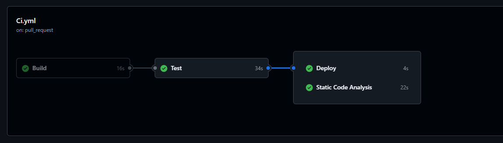

# DOSW-Library

## Diagrama de componentes general

---

## Diagrama de componentes especifico

---

## Diagrama de clases

---

## Pruebas

### Pruebas unitarias

---

---

## Video de evidencia

- [Video](https://youtu.be/87mfAid5HuE)

- [Video actualizado con parte 2](https://youtu.be/iKK2_mWsTwA)

- 

